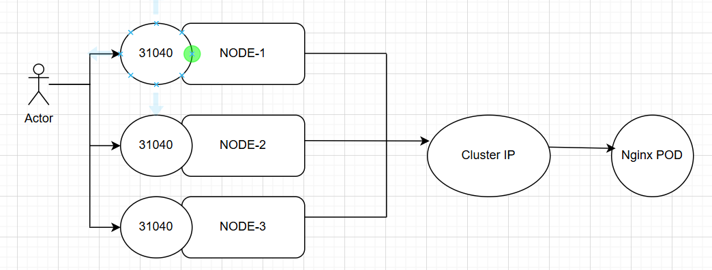
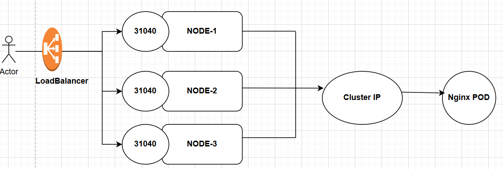

Services
----------------
 - Services are used to expose applications to outside world
 - To balance the load - deployment & replicaset
  1. ClusterIP - Within cluster
  2. NodePort - For Dev Environment
  3. LoadBalancer - Used for cloud

 ClusterIP
 -----------
 - kubectl get service or kubectl get svc
 - Login to one pod and use curl ip-address or curl name-of-service 
 - When we use name-of-service it is called service mesh as ip addresses keep on changing

 NodePort
 ----------
  - Kubernetes will open nodeport on each worker node and applications are accessible through workernode-ip:nodeport
  - Fixed nodeport can be included using nodePort: 31234
  - ClusterIP is subset of NodePort. So when NodePort is created ClusterIP is also created by default.
  - nodeport range: 30000 to 32767
  - NodePort can be used to allow traffic from outside but this leads to security risk as we are exposing each worker node ip address. Hence NodePort is used in Dev environment for testing purpose only

 How NodePort works?
 ----------------------
 

 LoadBalancer
 --------------
  - It is used for cloud k8s clusters only
  - ClusterIP is subset of NodePort and NodePort is subset of LoadBalancer
  - LoadBalancer will use round-robin algorithm to send requests to worker nodes
  - Add LB to Route53 so that we can access the application using DNS name

  How LoadBalancer works?
  --------------------------
